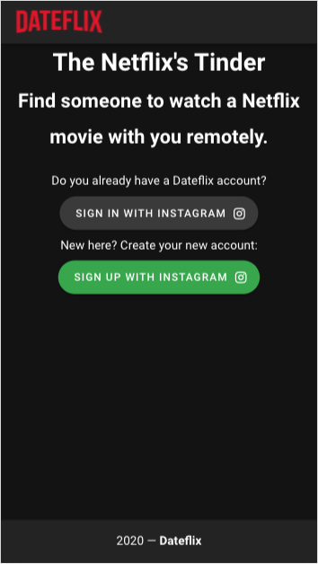
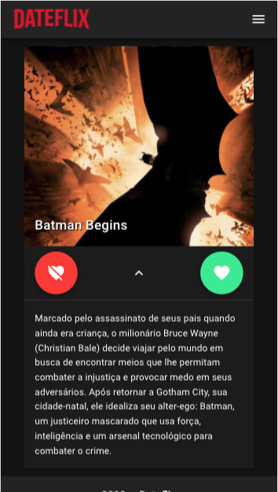
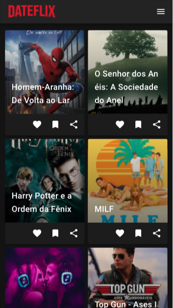

# Dateflix
Dateflix app, the Tinder for Netflix
  <br />
  <p align="center">
    <a href="https://dateflix.netlify.app/">
      
    </a>
  </p>
  <p align="center">
    Dateflix app, the Tinder for Netflix
    <br />
    <a href="https://www.getpostman.com/collections/2fa7017a38f30cc4ba55">Postman Collection</a>
    ·
    <a href="https://github.com/pythrick/dateflix/issues">Report Bug</a>
    ·
    <a href="https://github.com/pythrick/dateflix/issues">Request Feature</a>
  </p>
</p>

<!-- TABLE OF CONTENTS -->

## Table of Contents

- [About the Project](#about-the-project)
  - [Built With](#built-with)
- [Getting Started](#getting-started)
  - [Prerequisites](#prerequisites)
  - [Installation](#installation)
- [Usage](#usage)
- [Roadmap](#roadmap)
- [Contributing](#contributing)
- [License](#license)
- [Contact](#contact)


<!-- ABOUT THE PROJECT -->

## About The Project

<p align="center">
  <a href="https://dateflix.netlify.app/">
    
    
    
  </a>
</p>


### Built With

This project was built with the following technologies:

- [Go](https://go.dev/)
- [gorilla/mux](https://github.com/gorilla/mux)
- [GORM](https://gorm.io)
- [VueJS](https://vuejs.org/)

<!-- GETTING STARTED -->

## Getting Started

To get a local copy up and running follow these simple example steps.

### Prerequisites

List of things you need to use the software and how to install them.
- [Go](https://go.dev)

- [golangci-lint](https://golangci-lint.run/usage/install/#local-installation)

- [Docker](https://www.docker.com/get-started)

- [docker-compose](https://docs.docker.com/compose/install/)

- [postman](https://www.postman.com/downloads/)

### Installation

1. Create a Facebook App for Instagram, following [this tutorial](https://developers.facebook.com/docs/instagram-basic-display/getting-started).
2. Get a API Tokenb for The Movie DB, following [this tutorial](https://developers.themoviedb.org/3/getting-started/introduction)
3. Clone the repo
```sh
git clone https://github.com/pythrick/dateflix.git
```

4. Enter in repository directory

```sh
cd dateflix
```

5. Startup project

```sh
make install
```

<!-- USAGE EXAMPLES -->

## Usage

1. Run the API

```sh
make run
```
2. Import the Postman [collection](https://www.getpostman.com/collections/2fa7017a38f30cc4ba55), following this [tutorial](https://learning.postman.com/docs/getting-started/importing-and-exporting-data/#importing-data-into-postman).

<!-- ROADMAP -->

## Roadmap

See the [open issues](https://github.com/pythrick/dateflix/issues) for a list of proposed features (and known issues).

<!-- CONTRIBUTING -->

## Contributing

Contributions are what make the open source community such an amazing place to be learn, inspire, and create. Any contributions you make are **greatly appreciated**.

1. Fork the Project
2. Create your Feature Branch (`git checkout -b feature/AmazingFeature`)
3. Commit your Changes (`git commit -m 'Add some AmazingFeature'`)
4. Push to the Branch (`git push origin feature/AmazingFeature`)
5. Open a Pull Request

### Tests

Just run the command above.

```shell
make test
```


<!-- LICENSE -->

## License

Distributed under the MIT License. See `LICENSE` for more information.

<!-- CONTACT -->

## Contact

Patrick Rodrigues - [@pythrick](https://twitter.com/pythrick) - contact@patrickrodrigues.me

Project Link: [https://github.com/pythrick/dateflix/](https://github.com/pythrick/dateflix/)


## Notes
The project layout is based on [Standard Go Project Layout](https://github.com/golang-standards/project-layout).
